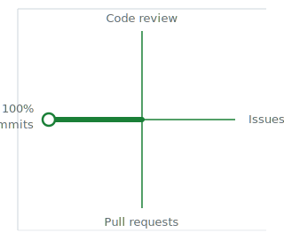

<div align="center">

### Xuepoo

Software Engineering Student · Rust & Python · AI Agent Enthusiast

</div>

---

**About**

- Software engineering undergraduate, building tools for music aesthetics, Wayland compositors, and LLM-powered workflows
- Rust · Python · Go · Linux (CachyOS/Arch)
- Off-screen: mystery novels, manga, music

---

**Tools**

<div align="center">


</div>

---

**Activity**

<div align="center">

</div>

---

**Install**

```bash
# macOS / Linux
brew tap Xuepoo/homebrew-tap && brew install Xuepoo/homebrew-tap/<package>

# Windows
scoop bucket add Xuepoo https://github.com/Xuepoo/scoop-bucket && scoop install Xuepoo/<package>
```

---

<div align="center">

[GitHub](https://github.com/Xuepoo) · [Email](mailto:your-email@example.com)

</div>